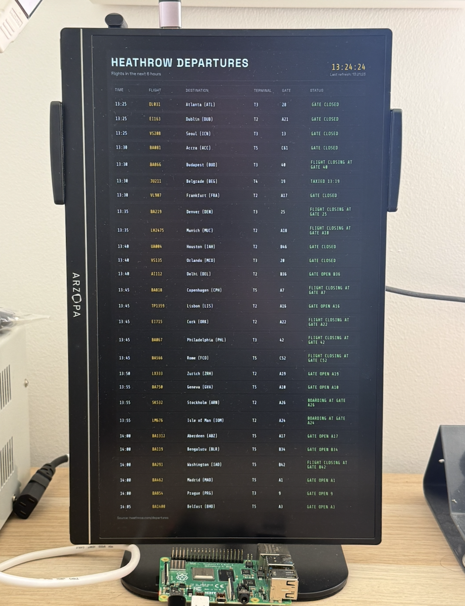

# Heathrow Departures Kiosk

A balena multi-container app that shows a live Heathrow departures board in a full-screen kiosk browser.



## Overview

This project runs two services:

- board: A Node.js web service that fetches departures data from Heathrow and serves a dark departure-board UI.
- browser: The balena browser block (`bh.cr/balenalabs/browser-aarch64`) that opens the board URL in kiosk mode.

The browser service points to `http://board`, so the app is self-contained inside the fleet.

## How it works

1. The `board` service starts an Express server on port 80.
2. On startup, it fetches departures data from Heathrow's departures API endpoint.
3. Data is normalized and filtered to flights departing in the next 6 hours (Europe/London timezone).
4. Marketing codeshare duplicates are removed.
5. Filtered flights are cached in memory.
6. The cache is refreshed on a configurable interval.
7. The web UI calls `/api/departures`, renders rows, and polls again at the same interval.
8. The `browser` service loads the board page in kiosk mode.

## Data source

The board uses Heathrow's departures feed endpoint:

- `https://api-dp-prod.dp.heathrow.com/pihub/flights/departures`

The request includes browser-like headers (`User-Agent`, `Referer`, `Origin`, `Accept`) so the endpoint returns JSON correctly.

## Configuration

Set environment variables in `docker-compose.yml` under the `board` service.

### `BOARD_REFRESH_INTERVAL_SECONDS`

- Purpose: Controls how often the board refreshes Heathrow data.
- Default in this project: `300` (5 minutes).
- Used by both backend cache refresh and frontend polling.

Example:

```yaml
services:
  board:
    environment:
      - BOARD_REFRESH_INTERVAL_SECONDS=300
```

## API endpoints

### `GET /api/departures`
Returns:

- `refreshedAt`: ISO timestamp for last successful refresh.
- `lastError`: Last refresh error message, or `null`.
- `refreshIntervalMs`: Poll interval in milliseconds.
- `flights`: Array of filtered departures.

Each flight includes:

- `flight`
- `airline`
- `destinationCity`
- `destinationAirport`
- `terminal`
- `gate`
- `statusCode`
- `statusText`
- `scheduledIso`
- `scheduledDisplay`

### `GET /health`
Health check endpoint for quick status:

- `ok`
- `refreshedAt`
- `lastError`
- `flightCount`

## UI behavior

- Dark departures-board style layout.
- Live London clock.
- Scrollable flights list with scrollbar visuals hidden for kiosk display.
- Status highlighting:
  - green: normal states
  - amber: delayed/last call
  - red: cancelled/diverted

## Project structure

```text
.
├── docker-compose.yml
├── README.md
└── board
    ├── Dockerfile
    ├── package.json
    ├── package-lock.json
    └── src
        ├── server.js
        ├── scrapeDepartures.js
        └── public
            ├── index.html
            ├── styles.css
            └── app.js
```

## Deploying to balena

From this project root:

```bash
balena push sam_duffield/browser-demo
```

## Local development (optional)

Run only the board service locally:

```bash
cd board
npm install
npm start
```

Then open:

- `http://localhost/`
- `http://localhost/api/departures`
- `http://localhost/health`

You can override refresh interval for local testing:

```bash
BOARD_REFRESH_INTERVAL_SECONDS=60 npm start
```

## Notes

- This board is read-only and intended for display use.
- Heathrow data content and field availability may change over time.
- If the upstream API changes, update `board/src/scrapeDepartures.js` mapping/filtering logic.
